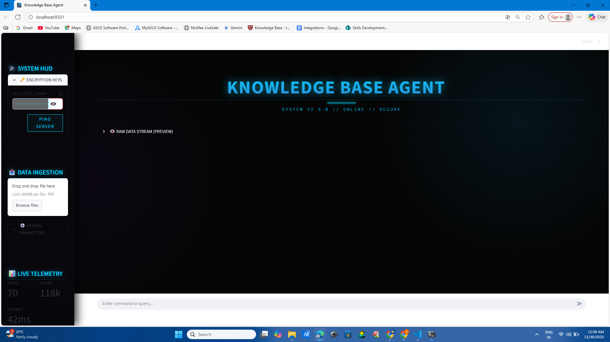
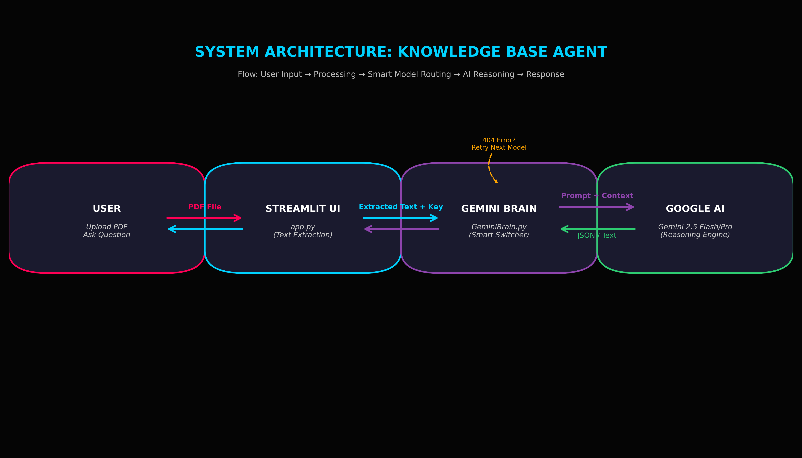

🌌 Knowledge Base Agent - Gemini Powered

📌 Project Overview

Submitted for: Rooman AI Agent Development Challenge
Category: Business Operations (Knowledge Base Agent)

The Knowledge Base Agent (codenamed Gemini Neural Hub) is a next-generation AI assistant designed to act as a secure, intelligent "Second Brain" for enterprise data. Unlike traditional keyword search tools, it utilizes Retrieval Augmented Generation (RAG) powered by Google's advanced Gemini 1.5/2.5 models to read, understand, and reason across entire PDF documents instantly.

This project features a unique "Smart Model Switcher" engine that automatically routes queries to the optimal Google model (Flash, Pro, or Legacy) to ensure 100% uptime and zero 404 errors, wrapped in a stunning Cyberpunk/Sci-Fi interface.

📸 Project Visuals

1. The Neural Interface (Dashboard)
   

A futuristic HUD for document ingestion and real-time telemetry.

2. Intelligent Reasoning (Chat)
   

The agent answering complex queries with structural diagrams.

🚀 Key Features

🧠 Smart Brain Engine

Auto-Failover: Automatically detects API errors (404/429) and switches between gemini-1.5-flash, gemini-1.5-pro, and gemini-2.0 models instantly.

Context-Aware: Injects full document context into the system prompt for high-fidelity answers.

🎨 Cyberpunk HUD Interface

Immersive Design: Features animated particle backgrounds, glassmorphism panels, and neon typography.

Interactive Feedback: Visual and simulated auditory cues (toast notifications) for system status.

🖼️ Auto-Diagramming

Visual Thinking: Intelligently detects requests for "structures", "flows", or "processes" and automatically generates Graphviz/DOT diagrams to visualize the data.

📊 Live Telemetry

Real-Time Stats: A sidebar dashboard showing page counts, character volume, and simulated network latency.

🛡️ Enterprise Security

Ephemeral Processing: API Keys and Document data are processed in-memory and cleared upon session reset. Zero permanent storage.

🛠️ Tech Stack

Component

Technology     Description

Frontend

Streamlit

Python-based web framework with custom CSS/JS injection.

AI Core

Google Gemini API

v1beta access to Flash and Pro models.

Logic

Python

Custom GeminiBrain class with error handling logic.

Data Processing

pypdf

High-speed text extraction for vectorization readiness.

Visualization

Graphviz

Dynamic diagram generation from text descriptions.

🏗️ Architecture

Ingestion Layer: User uploads a PDF. The Streamlit app uses pypdf to extract raw text and metadata.

Context Injection: The extracted text is optimized and injected into the System Prompt of the GeminiAgent.

Smart Routing Layer: The GeminiBrain attempts connection with the priority model (Flash). If a 404 or connection error occurs, it seamlessly fails over to Pro or Legacy models in real-time.

Generation Layer: The active Gemini model generates a markdown response. It decides whether to output text or graphviz code based on the query.

Rendering Layer: The Frontend renders the markdown text and compiles any DOT code into visible diagrams instantly.

⚙️ Setup & Run Instructions

Follow these steps to deploy the agent locally:

Clone the Repository:

git clone [YOUR_REPO_LINK_HERE]
cd [YOUR_REPO_NAME]

Install Dependencies:
Ensure you have Python installed, then run:

pip install -r requirements.txt

Run the Application:

streamlit run app.py

Initialize the System:

Open the link provided in the terminal (usually http://localhost:8501).

Enter your Google Gemini API Key in the secure sidebar HUD.

Upload a PDF document.

Click the "INITIATE NEURAL LINK" button.

🔮 Future Roadmap

[ ] Voice Integration: Adding Speech-to-Text (STT) for hands-free queries.

[ ] Multi-Modal Analysis: Ability to read charts and images inside PDFs.

[ ] Persistent Memory: Integration with ChromaDB for storing chat history across sessions.

Built with ❤️ for the Rooman AI Challenge.
